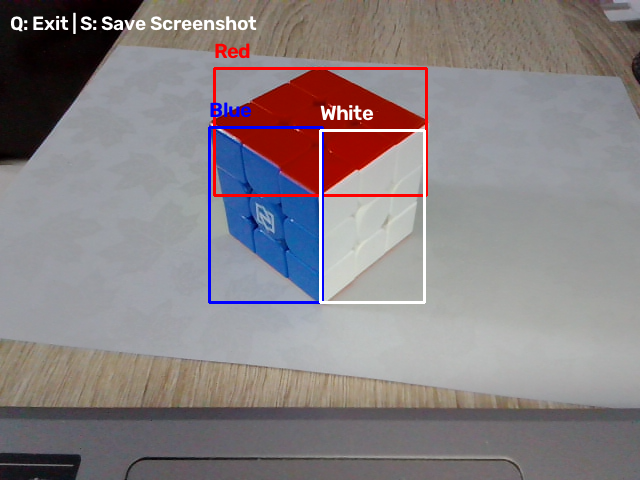
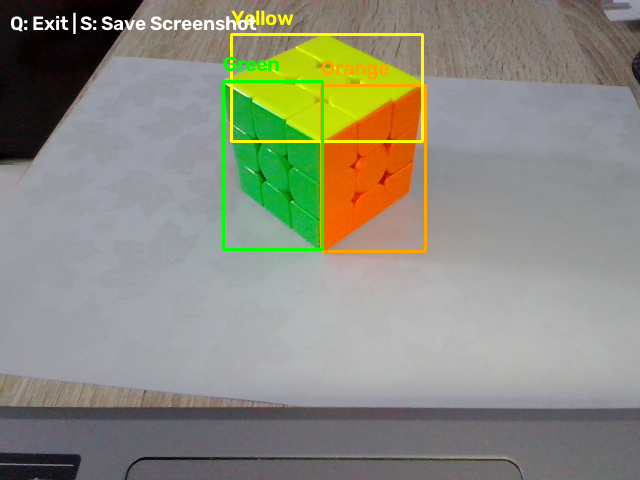

# Color Recognition Using OpenCV

## Project Overview

This project uses Python and OpenCV to recognize the six colors of a Rubik's Cube in real time using a webcam.

The program detects colored areas, draws a bounding box around them, and displays the name of each detected color.

## Recognized Colors

- Red
- Orange
- Yellow
- Green
- Blue
- White

## Tools and Libraries

- Python
- OpenCV
- NumPy
- Visual Studio Code

## Installation

Install the required libraries using:

```bash
pip install opencv-python numpy
```

## How to Run

1. Download or clone the repository.
2. Open the project folder in Visual Studio Code.
3. Open the terminal.
4. Run the following command:

```bash
python color_recognition.py
```

5. Place a Rubik's Cube in front of the webcam.
6. Press `S` to save a screenshot.
7. Press `Q` to close the program.

## How It Works

1. The webcam captures video frames in real time.
2. Each frame is converted from BGR to HSV color space.
3. HSV ranges are used to identify the six Rubik's Cube colors.
4. Small unwanted areas are removed using image-processing operations.
5. The program detects the colored regions and draws labeled bounding boxes around them.

## Output

### First Test



### Second Test



## Project Files

- [Python Code](color_recognition.py)
- [First Output Screenshot](output_screenshot_20260731_181329_994602.png)
- [Second Output Screenshot](output_screenshot_20260731_181450_654715.png)
